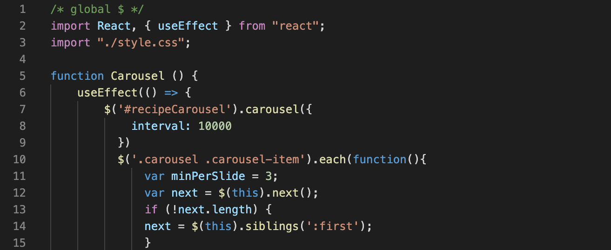

# react-portfolio

Building a profesional protfolio with react to become employer ready and competitive. Must include links to my Github, Linkedin, Resume, social media and contact information. 


## Table of Content
- Objective
- Deploy Link
- Getting Started
- Code Highlights
- Technology
- Author 

## Objective
Build a unique app that displays at least three projects with links to them, make sure all READMES are polished and employee ready as well as the apps themselves. Add links to Github, Linkedin, and a reume, as well as write out a short 'about me' section. Include contact information. 

## Deploy Link


## Getting Started
These instructions will get you a copy of the project up and running on your local machine for development and testing purposes. See deployment for notes on how to deploy the project on a live system.

```
$ git clone git@github.com:ayladillis/react-portfoio.git
ayladillis/react-portfoio.git
$ cd ayladillis/react-portfoio.git
```
Then open in your preferred text editor:
- [vim](https://www.vim.org/) 
- [emmacs](https://www.gnu.org/software/emacs/)
- [visual studio code](https://code.visualstudio.com/) 

## Code Highlight

This is the code I used to add the carousel of cards with my projects on them, the useEffect hook is how I added the Javascript and on line 11 I defined how many cards I wanted to be shown at once. 




## Technology
* [HTML](https://developer.mozilla.org/en-US/docs/Web/HTML)
* [CSS](https://developer.mozilla.org/en-US/docs/Web/CSS)
* [Javascript](https://developer.mozilla.org/en-US/docs/Web/JavaScrip)
* [JQuery](https://jquery.com/)
* [Heroku](https://dashboard.heroku.com)
* [Bootstrap](https://getbootstrap.com/)
* [React](https://reactjs.org/)
* [Github-Pages](https://pages.github.com/)
* [Node](https://node.js.org/)
* [Express](https://expressjs.com/)


## Author
### [Ayla Dillis](https://github.com/ayladillis)
- [LinkedIn](https://www.linkedin.com/in/ayladillis/)
- [Portfolio]()
- [Highlighted-Work](https://ayladillis.github.io/Coding-Bootcamp-Project-1-Zillow-Maps-API-AD/)
- email: aayladillis@gmail.com