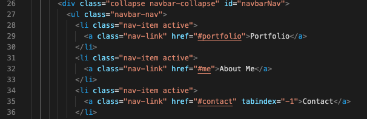
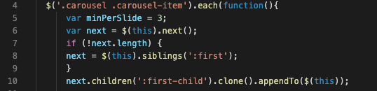

# react-portfolio

Building my profesional protfolio to become employer ready and competitive using react. Must include links to my Github, Linkedin, Resume, social media and contact information. 


## Table of Content
- Objective
- Deploy Link
- Getting Started
- Code Highlights
- Technology
- Author 

## Objective
Build a unique app that displays at least three projects with links to them, make sure all READMES are polished and employee ready as well as the apps themselves. Add links to Github, Linkedin, and a reume, as well as write out a short 'about me' section. Include contact information. 

## Deploy Link

https://polar-falls-52203.herokuapp.com/ 

## Getting Started
These instructions will get you a copy of the project up and running on your local machine for development and testing purposes. See deployment for notes on how to deploy the project on a live system.

```
$ git clone git@github.com:ayladillis/ayladillis_portfolio.git
ayladillis/ayladillis_portfolio.git
$ cd ayladillis/ayladillis_portfolio.git
```
Then open in your preferred text editor:
- [vim](https://www.vim.org/) 
- [emmacs](https://www.gnu.org/software/emacs/)
- [visual studio code](https://code.visualstudio.com/) 

## Code Highlight

Within my html I used href to navigate to different parts of my page 



Inorder to make the slide carousel of cards work I needed to build a function in Javascript, on line 5 specified how many slides I wanted to show at a time; 3



## Technology
* [HTML](https://developer.mozilla.org/en-US/docs/Web/HTML)
* [CSS](https://developer.mozilla.org/en-US/docs/Web/CSS)
* [Javascript](https://developer.mozilla.org/en-US/docs/Web/JavaScrip)
* [JQuery](https://jquery.com/)
* [Heroku](https://dashboard.heroku.com)
* [Bootstrap](https://getbootstrap.com/)

## Author
### [Ayla Dillis](https://github.com/ayladillis)
- [LinkedIn](https://www.linkedin.com/in/ayladillis/)
- [Portfolio]()
- [Highlighted-Work](https://ayladillis.github.io/Coding-Bootcamp-Project-1-Zillow-Maps-API-AD/)
- email: aayladillis@gmail.com